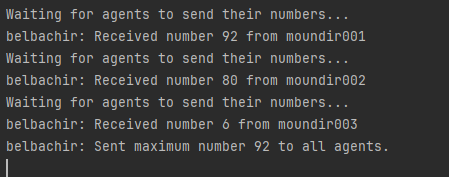
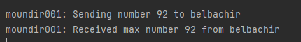
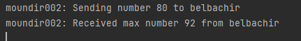
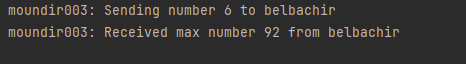

# Agent_Calcul Class - Inter-Agent Communication

The `Agent_Calcul` class represents a Jade agent responsible for calculating and communicating the maximum number received from other agents.

## Class Summary

- **Attributes:**
  - `maxNumber`: Holds the maximum number received from other agents.
  - `uniqueSenders`: A set to keep track of unique sender agents.
  - `agentsCount`: Number of agents expected to send their numbers.

- **Methods:**
  - `setup()`: Initializes the agent and adds a behavior for receiving and processing messages from other agents.
  - `SendMaxNumberBehavior`: An inner class that extends `Behaviour`. It sends the maximum number to all agents once all unique agents have sent their numbers.
  - `action()`: Contains the logic for receiving, processing, and sending messages.
  - `done()`: Indicates when the agent has received numbers from all unique agents.

## Logic

- The agent listens for messages from other agents containing a number.
- It keeps track of the maximum number received and unique sender agents.
- Once all unique agents have sent their numbers, the agent initiates the `SendMaxNumberBehavior` to inform all agents about the maximum number.

## Output

The agent outputs messages to the console, including information about received numbers and when the maximum number is sent to all agents.

**Example Output:**

# Agent001 - Inter-Agent Communication

The `Agent001` class represents a Jade agent that participates in an inter-agent communication scenario. It follows a similar logic as the `Agent_Calcul` class for sending and receiving messages.

## Class Summary

- **Setup:**
  - Generates a random number and sends it to the specified agent (`belbachir` in this case) using an `INFORM` message.
  - Outputs a message indicating the sent number and the recipient agent.

- **Receiving Max Number:**
  - Adds a `CyclicBehaviour` to continuously listen for messages.
  - When a message is received, it extracts and prints the maximum number received from the `Agent_Calcul`.
  - Uses the `block()` method to wait for messages.

## Output

The agent outputs messages to the console indicating the sent number and, later, the received maximum number from the `Agent_Calcul`.

**Example Agent001 Output:**

# Agent002 and Agent003

Agents `Agent002` and `Agent003` follow a similar logic for sending and receiving messages.

## Output

**Example Agent002 Output:**

**Example Agent003 Output:**

